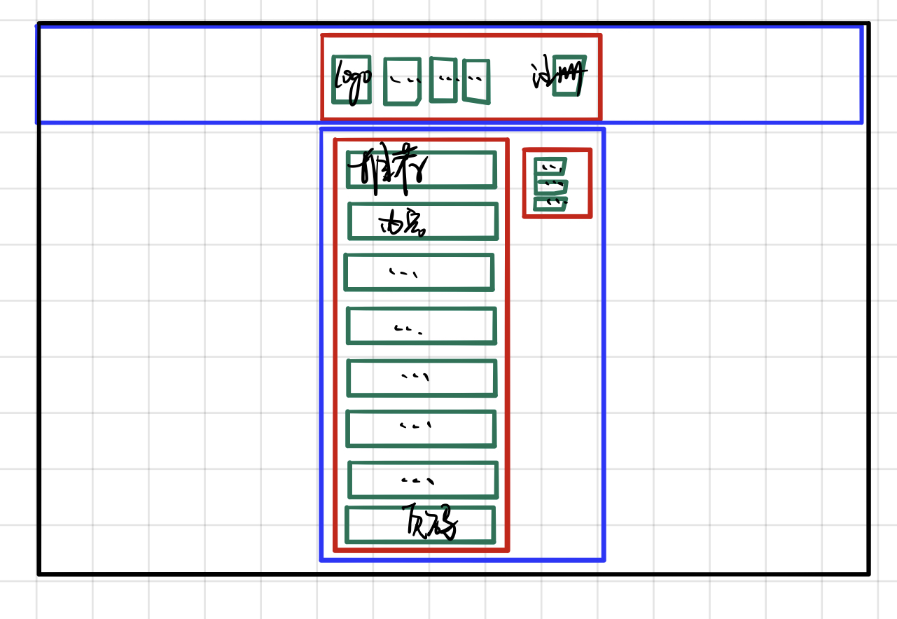
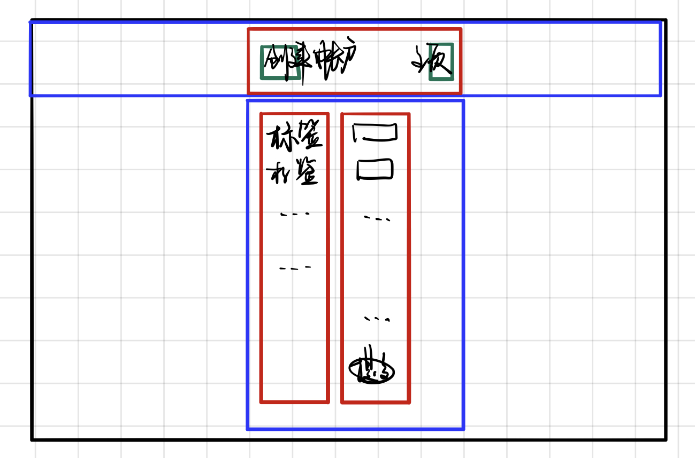

LAB 3 设计文档
==========

## 主页布局
基本上完全参考知乎主页的布局，`导航栏`在上面。下面的内容部分作为主块水平居中，切分成左右两块，左边是`推荐`内容，右边是`功能栏`。

统一了主题颜色绿色，光标放在`导航栏`，`功能栏`的组件上还有`赞同`按钮上会产生变色。

-------------------
## 注册页布局
注册页的`导航栏`用了和主页`导航栏`一样的设计。

表单部分作为一个主块，水平居中，把`标签`和`input`分成两个块各自对齐，更加整洁。

