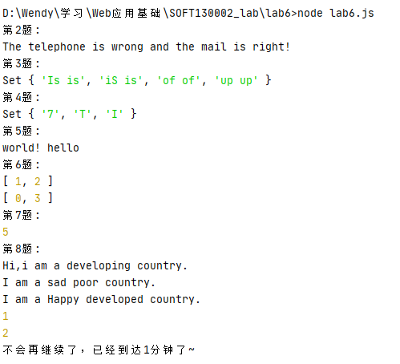
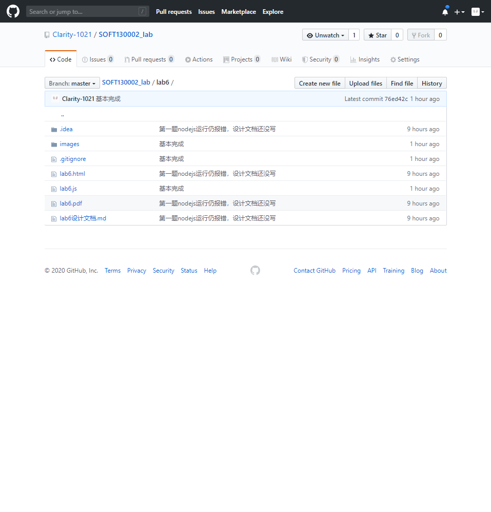

## 解决方法

### 各个正则表达式的解释

1. 邮箱的正则表达式：
`/^([\w-])+@([a-z/d])+((\.[a-z]{2,3}){1,2})$/`
^是开始；$是结束；@之前的是大小写加数字加下划线加-的混合串；@之后先跟的是字母；
再是.加上二到三个小写字母的串，这样的串可以只有一个，也可以有两个

2. 电话号码的正则表达式：
`/^1[3-9]\d{9}$/`
^是开始；$是结束；以1打头；第二位只能是3-9之间的数字；之后是9个0-9的数字

3. i是忽略大小写的正则匹配模式

### 继承不同方式的理解

1. 构造函数：在子类构造函数中调用父类的构造函数；子类不能继承父类原型上的方法

2. 原型链：子类继承父类原型上的方法；子类的所有实例会有相同的当时用父类实例化的原型；
构造函数不包括构造父类原型中的数据的初始化

3. Object.create：子类继承父类原型上的方法，使用现有的对象来提供新创建的对象的__proto__

### Map、Set、Array之间的区别和使用
1. Map中一对一键值单向映射，以键值做索引
2. Set中的元素各不相同
3. Array以数字做索引

## 网页截图

## gitHub截图

